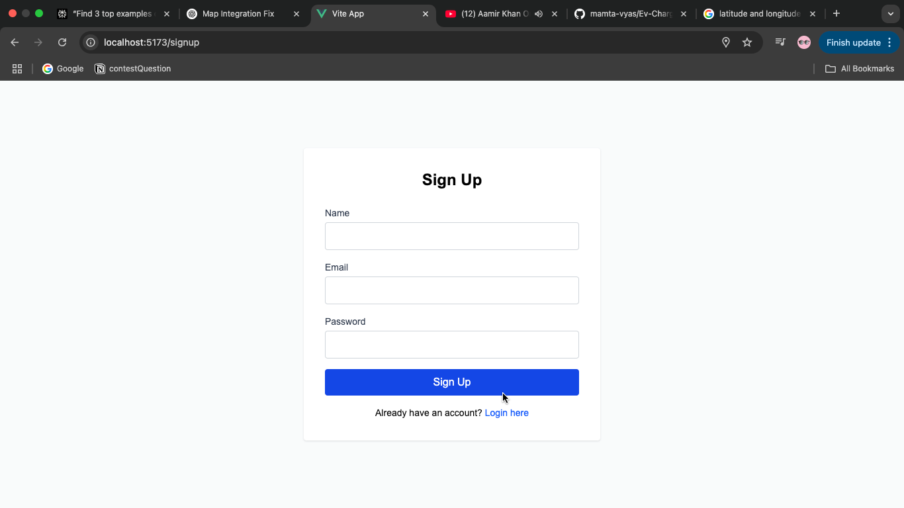
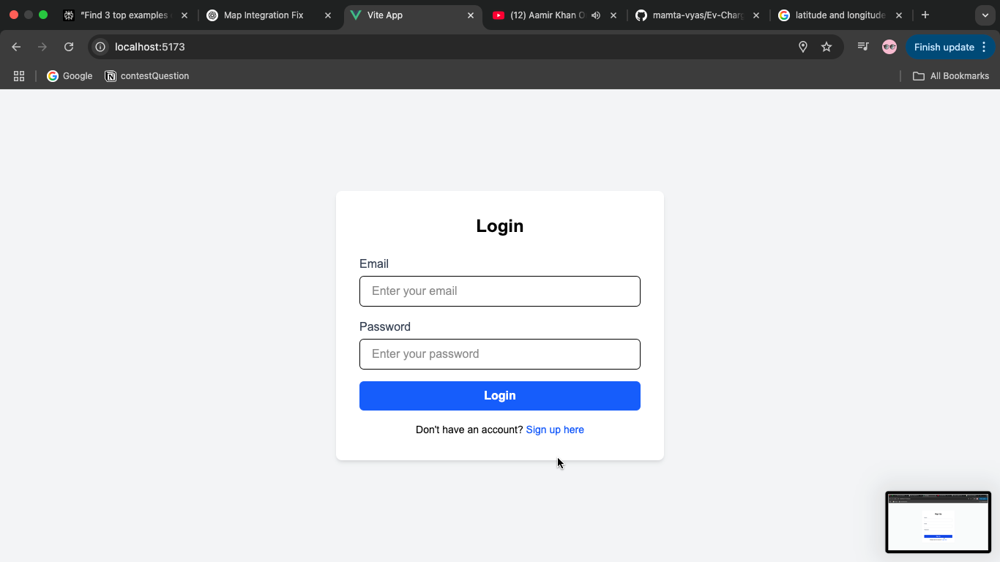
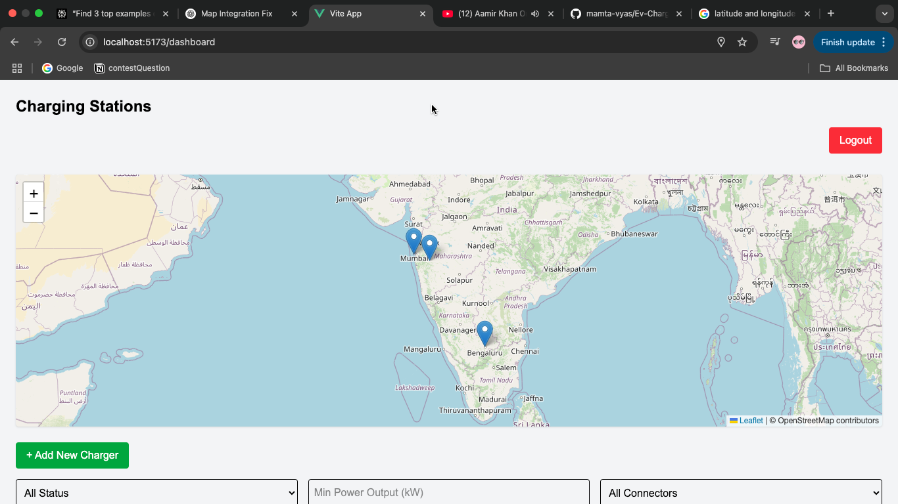
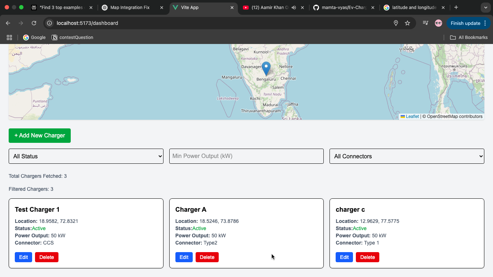
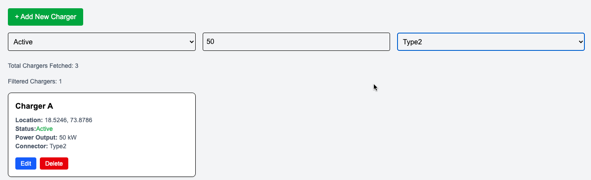

⚡ EV Charger Management App

A full-stack EV (Electric Vehicle) Charger Management application that allows users to register, login,logout, and manage EV charging stations with geolocation, filtering, and map visualization.

Built using Vue 3 + Vite for the frontend and Node.js + Express + MongoDB for the backend. Authentication is handled using JWT, and all sensitive routes are protected.

📸 Demo

hosted app demo link - 

screenshots - 

### 🔐 Signup Page

### 🔐 Login Page

### 🔐 Map View 

### 🔐 Dashboard View with ChargerCard

### 🔐 Dashboard View with filter

🧩 Folder Structure

Ev-Charger-App/
├── backend/
│   ├── config/
│   │   └── db.js
│   ├── middleware/
│   │   └── authMiddleware.js
│   ├── models/
│   │   ├── Charger.js
│   │   └── User.js
│   ├── routes/
│   │   ├── authRoutes.js
│   │   └── chargerRoutes.js
│   ├── server.js
│   └── package.json
└── frontend/
    ├── index.html
    ├── package.json
    ├── vite.config.js
    ├── jsconfig.json
    ├── postcss.config.mjs
    ├── src/
    │   ├── App.vue
    │   ├── main.js
    │   ├── axios.js
    │   ├── assets/
    │   │   ├── base.css
    │   │   ├── logo.svg
    │   │   └── main.css
    │   ├── components/
    │   │   ├── ChargerCard.vue
    │   │   └── ChargerForm.vue
    │   ├── composables/
    │   │   └── useGeolocation.js
    │   ├── router/
    │   │   └── index.js
    │   └── views/
    │       ├── DashboardView.vue
    │       ├── LoginView.vue
    │       ├── SignupView.vue
    │       └── MapView.vue
🚀 Features
🔒 Authentication
User Signup/Login

JWT-based protected routes

🔐 JWT-Protected Routes

This app features secure, token-based routing using JWT authentication.

🧭 Charger Management Features

Add / Edit / Delete EV Chargers

Dashboard View: View all chargers in a centralized dashboard

Filtering Options: Filter chargers by

Status

Power Output

Connector Type

Geolocation Support: Uses browser APIs to detect and show user location

Map View: Display chargers on a map using OpenStreetMap

Real-time UI Updates after CRUD operations

🌐 Frontend Features

Built with Vue 3 + Vite

Tailwind CSS for modern responsive UI

Axios for API calls

Fully responsive and mobile-friendly layout

⚙️ Backend Features

Built using Node.js + Express.js

MongoDB with Mongoose for data handling

JWT for authentication

Uses dotenv for environment variables

Handles CORS for cross-origin requests

🔑 API Endpoints
👤 Auth Routes

Method	Endpoint	Description

POST	/api/auth/signup	Register a new user

POST	/api/auth/login	Login and receive JWT

⚡ Charger Routes (Protected)
All routes require:

Authorization: Bearer <your_token> in request headers.

Method	Endpoint	Description

GET	/api/chargers	Get all chargers

POST	/api/chargers	Add new charger

PUT	/api/chargers/:id	Update charger by ID

DELETE	/api/chargers/:id	Delete charger by ID

🔧 Environment Configuration
Create a .env file inside the /backend directory:

env

PORT=5000

MONGO_URI=your_mongodb_connection_string

JWT_SECRET=your_very_secret_key

✅ Add .env to .gitignore

🛠️ Setup Instructions

📦 Backend Setup

git clone https://github.com/mamta-vyas/Ev-Charger-App.git

cd Ev-Charger-App/backend

npm install

➡️ Create your .env file

then start the server:
nodemon server.js
# or
node server.js

🌐 Frontend Setup

cd ../frontend

npm install

npm run dev

🔗 App runs at: http://localhost:5173

🧪 Test Credentials
Use these for quick testing:

Email: test@example.com  
Password: test123

Or sign up through the registration page.

📤 Deployment Notes
Deploy frontend using Vercel or Netlify

Deploy backend using Render, Railway, or Cyclic

Make sure to update the API base URL in the frontend for production

🧠 Author
Mamta Vyas
Frontend Developer • Open Source Enthusiast

[GitHub] (https://github.com/mamta-vyas ) 

[LinkedIn] (https://www.linkedin.com/in/mamtavyas/)
