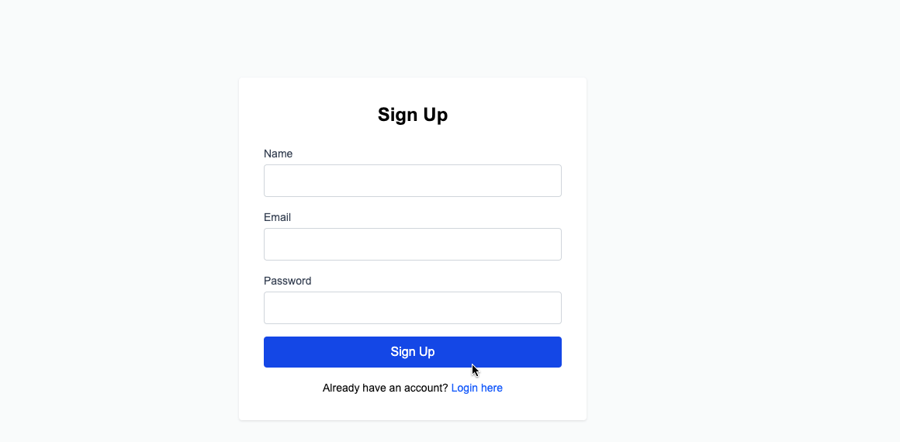
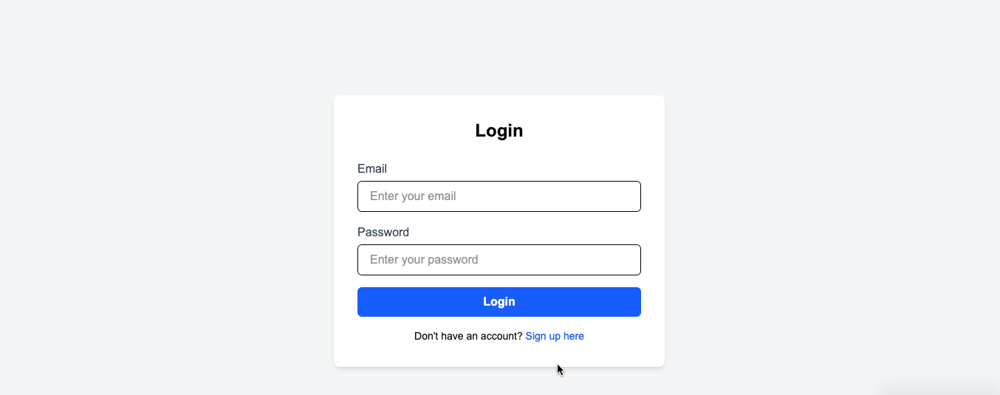
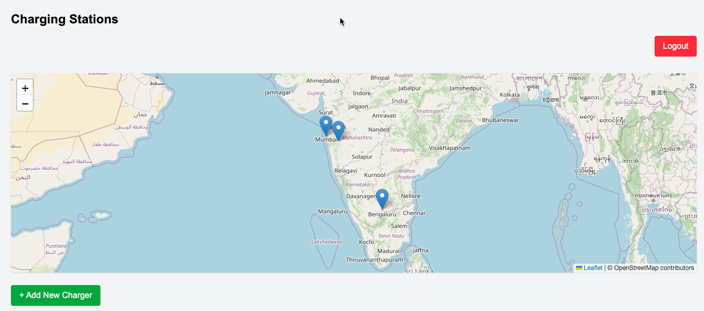

⚡ EV Charger Management App

A full-stack EV (Electric Vehicle) Charger Management application that allows users to register, log in,l ogout, and manage EV charging stations with geolocation, filtering, and map visualization.

Built using Vue 3 + Vite for the frontend and Node.js + Express + MongoDB for the backend. Authentication is handled using JWT, and all sensitive routes are protected.

📸 Demo

hosted app demo link - 

screenshots - 

### 🔐 Signup Page

### 🔐 Login Page

### 🔐 Map View 

### 🔐 Dashboard View with ChargerCard

### 🔐 Dashboard View with filter

🧩 Folder Structure

Ev-Charger-App/
├── backend/
│   ├── config/
│   │   └── db.js
│   ├── middleware/
│   │   └── authMiddleware.js
│   ├── models/
│   │   ├── Charger.js
│   │   └── User.js
│   ├── routes/
│   │   ├── authRoutes.js
│   │   └── chargerRoutes.js
│   ├── server.js
│   └── package.json
└── frontend/
    ├── index.html
    ├── package.json
    ├── vite.config.js
    ├── jsconfig.json
    ├── postcss.config.mjs
    ├── src/
    │   ├── App.vue
    │   ├── main.js
    │   ├── axios.js
    │   ├── assets/
    │   │   ├── base.css
    │   │   ├── logo.svg
    │   │   └── main.css
    │   ├── components/
    │   │   ├── ChargerCard.vue
    │   │   └── ChargerForm.vue
    │   ├── composables/
    │   │   └── useGeolocation.js
    │   ├── router/
    │   │   └── index.js
    │   └── views/
    │       ├── DashboardView.vue
    │       ├── LoginView.vue
    │       ├── SignupView.vue
    │       └── MapView.vue
🚀 Features
🔒 Authentication
User Signup/Login

JWT-based protected routes

🧭 Charger Management
Add / Edit / Delete EV Chargers

View all chargers in a dashboard

Filtering: by status, power output, and connector type

Geolocation support using browser APIs

🌐 UI (Frontend)
Responsive layout using Tailwind CSS

Map View with markers (via OpenStreetMap)

Real-time updates after CRUD actions

🧰 Tech Stack
Frontend
Vue 3

Vite

Tailwind CSS

Axios

Backend
Node.js

Express.js

MongoDB

Mongoose

JWT

dotenv

CORS

🔐 Backend API Endpoints
🔑 Auth Routes
Method	Endpoint	Description
POST	/api/auth/signup	Register a new user
POST	/api/auth/login	Login and get JWT

⚡ Charger Routes (Protected)
Method	Endpoint	Description
GET	/api/chargers	Get all chargers
POST	/api/chargers	Add new charger
PUT	/api/chargers/:id	Update charger by ID
DELETE	/api/chargers/:id	Delete charger by ID

⚠️ All charger routes require Authorization: Bearer <your_token> in headers.

🔧 .env Configuration
Create a .env file inside the /backend directory:

PORT=5000
MONGO_URI=your_mongodb_connection_string
JWT_SECRET=your_very_secret_key
✅ Don’t forget to add .env to .gitignore

🛠️ Setup Instructions

📦 Backend Setup

git clone https://github.com/mamta-vyas/Ev-Charger-App.git
cd Ev-Charger-App/backend
npm install

➡️ Create your .env file as shown above, then:

nodemon server.js
# or
node server.js

🌐 Frontend Setup

cd ../frontend
npm install
npm run dev
App will be available at: http://localhost:5173

🧪 Test Credentials
You can use these credentials for quick testing:

Email: test@example.com
Password: test123
Or register a new user from the signup page.

📤 Deployment Notes
Deploy frontend separately (e.g., Vercel/Netlify)

Deploy backend on services like Render, Railway, or Cyclic

Configure your deployed frontend to use the deployed backend API endpoint

🧠 Author
Mamta Vyas
Frontend Developer • Open Source Enthusiast
[GitHub](https://github.com/mamta-vyas) 
[LinkedIn] (https://www.linkedin.com/in/mamtavyas/)
